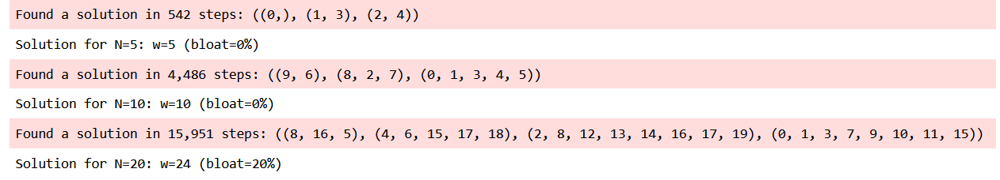

# Lab 1: Set Covering

First of all i implemented a breadth first search, that gives as results:

Then i tried to improve the priority function, for each we are going to
add to the soluition we take into account the number of elements in the
list that are already in the current solution:
    
    len(newlist)-3*len(set(newlist)-set([item for sublist in selected for item in sublist]))
and we used it first summed to the cost of the current solution:
    
    (sum(len(_) for _ in solution)-N)/N
obtaining:

and then without it:

